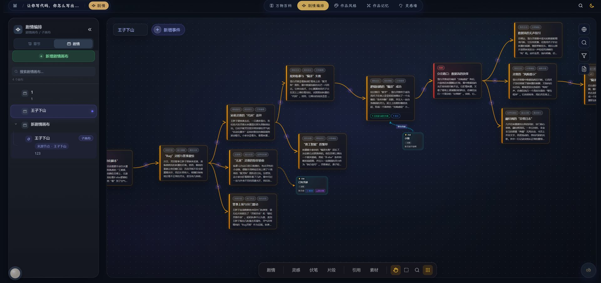
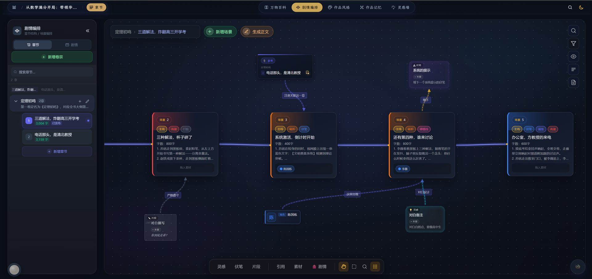
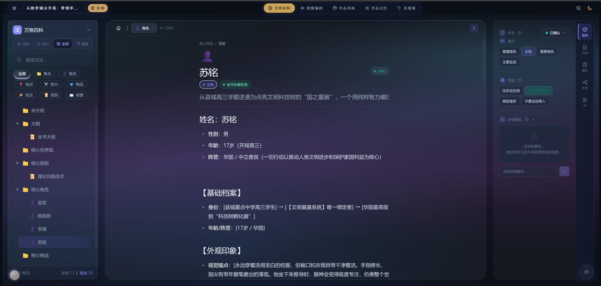
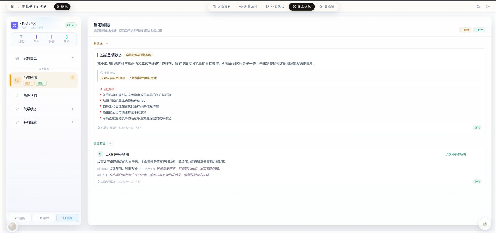
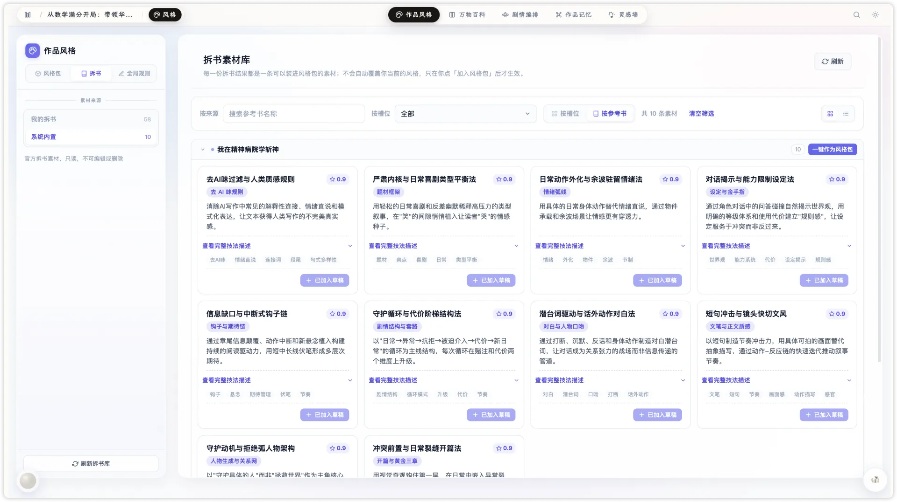
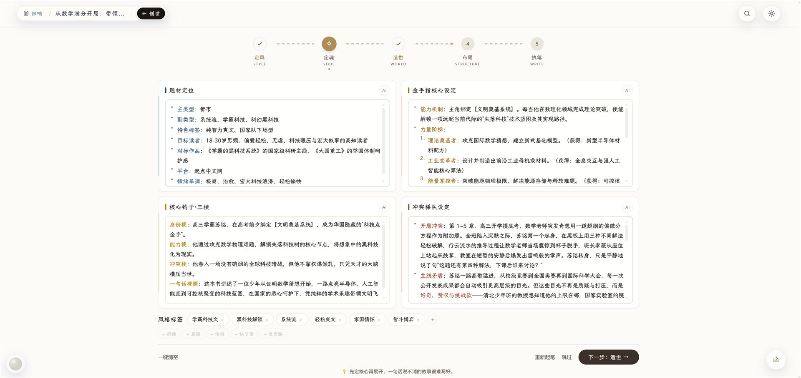
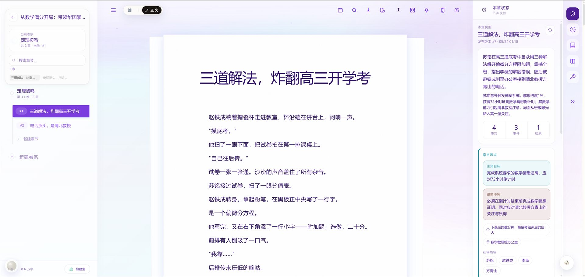

# 墨灵小说 · InkSpire

**当墨水拥有了灵魂**

 &nbsp; [官网](https://inkspires.cn) · [文档](https://doc.inkspires.cn) · [定价](https://inkspires.cn/pricing) · [反馈](../../issues/new/choose)

---

> 本仓库是墨灵小说的 **问题反馈与功能建议** 收集入口，同时也作为产品介绍页。遇到 Bug、有功能想法、不知道怎么用，都欢迎 [提交 Issue](../../issues/new/choose)。

## 这是什么？

墨灵小说（InkSpire）是一款专为网文作者打造的 AI 创作工作台。不是又一个 ChatGPT 套壳，而是从世界观、人物、大纲到正文的完整创作系统，让一个人也能高效写出百万字长篇小说。

## 产品演示

https://github.com/user-attachments/assets/f58935ba-f2ef-4824-a0f4-0e68c83d4d9d

## 截图

### 剧情画布 -- 可视化掌控每一条故事线

拖拽节点规划剧情走向，AI 必须遵守你设定的走向，不是"参考"，是"必须走"。

### 章节画布 -- 结构化大纲，一目了然

每个节点是一章，拖拽调整顺序，AI 批量生成后逐章审阅采纳。

### 万物百科 -- AI 的长期记忆

世界观、人物、势力、法宝沉淀为结构化知识库，AI 调用时自动注入上下文，写到 100 万字设定也不会漂移。

### 真相记忆 -- 伏笔追踪，永不遗忘

追踪长篇伏笔、人物状态、关系演变。写到第 50 章你忘了掌门姓什么？百科帮你记着。

### 拆书 -- 读一本爆款，拆出一套写法

上传任意参考书，AI 按维度拆解写作技法：文笔、对白、结构、钩子……逐槽位产出可复用素材，一键生成风格包，让 AI 模仿爆款的写法。系统内置经典作品拆解，开箱即用。

### 创世 -- 从零开始，五步成书

定魂 → 风格 → 世界观 → 结构 → 开写，创世台引导你从一句话灵感走到完整大纲，每一步都有 AI 辅助生成。

### 沉浸式工作区 -- 画布 / 百科 / 编辑器，不切换

所有工具在同一系统内，进入心流后不需要跳出去查笔记、切工具。

### 数据中心 -- 创作数据一目了然

## 为什么不用 ChatGPT 写小说？

| | ChatGPT | 墨灵小说 |
|---|---|---|
| 上下文 | 只有当次对话 | 自动注入世界观 + 人物 + 已写内容 |
| 长篇一致性 | 写到 20 章后人设崩坏 | 画布约束 AI 走向，百科锁死设定 |
| 大纲管理 | 靠你自己记 | 剧情画布可视化拖拽编辑 |
| 设定追踪 | 写到 50 万字忘了掌门姓什么 | 万物百科 + 真相记忆，永不漂移 |
| 写作流程 | 对话框里写，写到哪算哪 | 世界观 → 人物 → 画布 → 章节，流程闭环 |

## 核心能力

**可视化画布，掌控剧情走向**

剧情画布和章节画布是你和 AI 之间的契约。你在画布上规划的每一个节点、每一条连线，AI 都必须遵守。不是"参考建议"，是"硬性边界"。全自动推进，也是在你的世界里推进。

**AI 书灵，不是裸聊**

AI 书灵基于多个大模型混合调度，每次调用自动注入你的世界观百科、人物设定、画布约束和已写内容。生成的人设一致、剧情连贯，你只需润色即可发表。支持续写、扩写、改写、润色、对话生成。

**万物百科 + 真相记忆，百万字不崩设定**

百科词条是 AI 的长期记忆。人物、势力、地点、法宝 -- 写到哪，AI 早就知道那里有什么。真相记忆追踪伏笔和人物状态演变，设定不会漂移，因为它被锁在系统里了。

**拆书模仿，拆出爆款写法**

上传一本你喜欢的参考书，AI 按维度拆解写作技法：文笔风格、对话节奏、结构布局、钩子设计……逐槽位产出可复用素材。一键生成风格包，让 AI 在续写时模仿爆款的写法，而不是千篇一律的机器腔调。系统内置经典作品拆解，开箱即用。

**创世台，五步从灵感到大纲**

定魂（故事核）→ 风格（拆书/风格包）→ 世界观 → 结构（章节大纲）→ 开写。每一步都有 AI 辅助生成，你只需做选择和调整，从一句话灵感到完整大纲，最快 30 分钟。

## 谁在用？

- **网文新人** -- 用 AI 起手式快速完成开局，跨越 30 万字断更门槛
- **职业网文作者** -- 用世界观引擎管理 IP 宇宙，多书同步推进
- **同人 / 短篇创作者** -- 用 AI 书灵快速产出场景与对话
- **剧本与游戏文案** -- 用剧情画布串联多线分支叙事

## 免费吗？

注册即可免费使用 AI 书灵进行续写、扩写、润色，长篇章节管理完全免费。高频 AI 调用可订阅付费档解锁。

详见 [定价方案](https://inkspires.cn/pricing)。

## 反馈与问题

遇到问题或有功能建议？欢迎提交 Issue：

- [Bug 反馈](../../issues/new?template=bug_report.md) -- 功能异常、体验问题
- [功能建议](../../issues/new?template=feature_request.md) -- 你希望增加的功能
- [使用疑问](../../issues/new?template=question.md) -- 不知道怎么用

我们会认真看每一条 Issue。

## 链接

- 官网：[inkspires.cn](https://inkspires.cn)
- 文档：[doc.inkspires.cn](https://doc.inkspires.cn)
- 定价：[inkspires.cn/pricing](https://inkspires.cn/pricing)
- 常见问题：[inkspires.cn/faq](https://inkspires.cn/faq)

---

**一句话，或者一万字的规划——故事都将浑然天成。**

[立即开始创作](https://inkspires.cn/login?tab=register)

